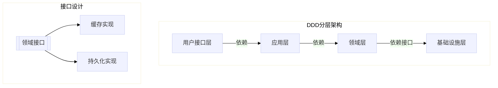

# Go语言DDD/TDD开发规范



## 架构规范

### 1. 分层结构
```text
/project-root
├── internal
│   ├── interfaces   # 接口层
│   ├── application  # 应用服务
│   ├── domain       # 领域模型
│   │   ├── entity      # 聚合根/实体
│   │   ├── valueobject # 值对象
│   │   └── service     # 领域服务
│   └── infrastructure # 基础设施实现
│       ├── cache       # 内存库实现
│       └── persistence # 持久化实现
```

### 2. 接口编程规范
```go
// 领域层定义接口
type CacheRepository interface {
    Get(key string) (interface{}, error)
    Set(key string, value interface{}) error
}

// 基础设施层实现
type MemoryCache struct {
    store sync.Map
    mutex sync.RWMutex
}

func (m *MemoryCache) Get(key string) (interface{}, error) {
    m.mutex.RLock()
    defer m.mutex.RUnlock()
    // 实现细节...
}
```

## TDD流程规范

```mermaid
sequenceDiagram
    开发者->>+测试套件: 1. 编写接口测试
    测试套件-->>-开发者: 失败（红）
    开发者->>+实现代码: 2. 最小实现
    测试套件-->>-开发者: 通过（绿）
    开发者->>+代码库: 3. 重构优化
```

## 质量要求

### 测试覆盖率
| 层级 | 覆盖率要求 | 接口测试要求 |
|------|------------|--------------|
| 领域层 | ≥95% | 100%接口覆盖 |
| 应用层 | ≥90% | 核心流程测试 |
| 基础设施 | ≥85% | 集成测试 |

## 开发流程

1. 定义领域接口
2. 编写接口测试用例
3. 实现基础设施
4. 编写领域模型
5. 实现应用服务
6. 持续重构优化

## 代码审查标准

1. 符合领域模型的业务语义
2. 遵循接口隔离原则
3. 测试用例覆盖所有分支
4. 符合golangci-lint规范
5. 文档与代码同步更新