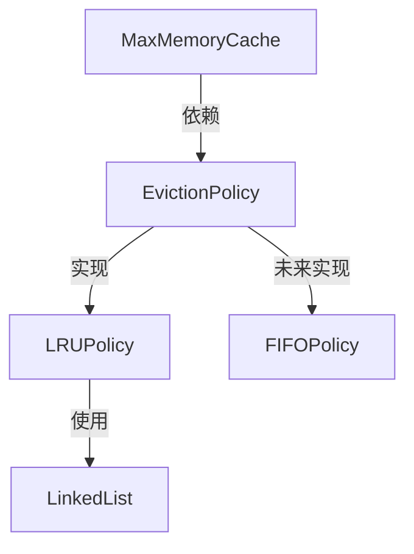

# MaxMemoryCache 重构计划

## 重构目标
- 将 LRU 策略抽离为独立模块
- 定义统一的淘汰策略接口
- 支持未来添加 FIFO 等其他算法
- 保持现有功能不变

## 实施步骤

### 1. 创建策略接口文件
在 `internal/infrastructure/cache` 目录下创建 `eviction_policy.go`：
```go
package cache

// EvictionPolicy 定义缓存淘汰策略接口
type EvictionPolicy interface {
    KeyAccessed(key string) // 记录key被访问
    Evict() string          // 执行淘汰
    Remove(key string)      // 移除指定key
}
```

### 2. 实现LRU策略
在 `internal/infrastructure/cache` 目录下创建 `lru_policy.go`：

```go
package cache

import (
    "github.com/justinwongcn/hamster/internal/domain/tools"
)

type LRUPolicy struct {
    list *tools.LinkedList[string]
    keys map[string]int
}

func NewLRUPolicy() *LRUPolicy {
    return &LRUPolicy{
        list: tools.NewLinkedList[string](),
        keys: make(map[string]int),
    }
}

func (l *LRUPolicy) KeyAccessed(key string) {
    // 实现访问记录逻辑
}

func (l *LRUPolicy) Evict() string {
    // 实现淘汰逻辑
}

func (l *LRUPolicy) Remove(key string) {
    // 实现key移除逻辑
}
```

### 3. 修改 MaxMemoryCache
主要变更点：
- 移除 `keys` 字段
- 添加 `policy` 字段
- 修改相关方法

```go
type MaxMemoryCache struct {
    Cache  interfaces.Cache
    max    int64
    used   int64
    mutex  *sync.Mutex
    policy EvictionPolicy // 新增策略接口
}
```

### 4. 调整测试文件
更新 `max_memory_cache_test.go` 以使用新的策略接口。

## 架构流程图


## 后续计划
1. 实现 LRU 策略具体逻辑
2. 更新测试用例
3. 验证功能完整性
4. 添加 FIFO 策略实现