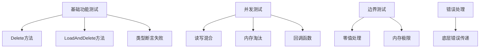

# MaxMemoryCache 测试增强方案

## 测试目标
1. 将测试覆盖率从77.4%提升至85%以上
2. 覆盖所有关键代码路径
3. 验证高并发场景下的线程安全

## 测试策略


## 详细测试用例

### 1. Delete方法测试
```go
func TestMaxMemoryCache_Delete(t *testing.T) {
    // 测试用例1: 删除存在的key
    // 测试用例2: 删除不存在的key 
    // 验证used内存统计
    // 验证policy更新
}
```

### 2. LoadAndDelete方法测试
```go
func TestMaxMemoryCache_LoadAndDelete(t *testing.T) {
    // 测试用例1: 存在key的正常操作
    // 测试用例2: key不存在的场景
    // 验证返回值和内存统计
}
```

### 3. 并发压力测试
```go
func TestMaxMemoryCache_ConcurrentStress(t *testing.T) {
    // 100个goroutine并发读写
    // 混合Set/Get/Delete操作
    // 使用-race参数检测
    // 验证最终一致性
}
```

### 4. 内存淘汰并发测试
```go
func TestMaxMemoryCache_ConcurrentEviction(t *testing.T) {
    // 内存设置为临界值
    // 多个goroutine同时触发淘汰
    // 验证淘汰顺序和回调
}
```

## 实施步骤
1. 编写新增测试用例
2. 运行测试并生成覆盖率报告
3. 分析未覆盖的代码路径
4. 补充缺失的测试用例
5. 重复直到覆盖率达标

预计新增测试用例将覆盖以下关键路径：
- Delete方法的锁机制和内存统计
- LoadAndDelete的返回值处理
- 类型断言失败的错误处理
- 高并发下的数据一致性